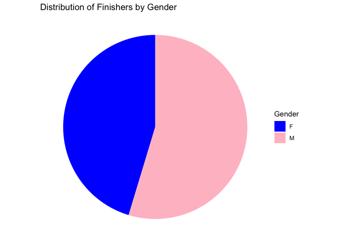
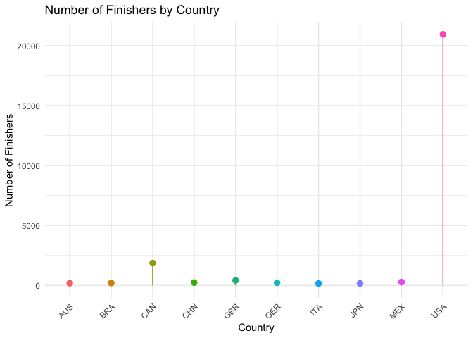
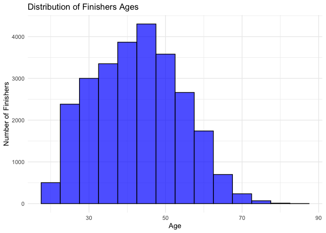
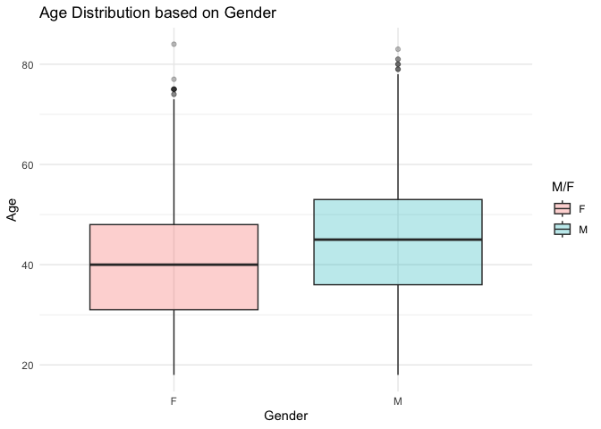
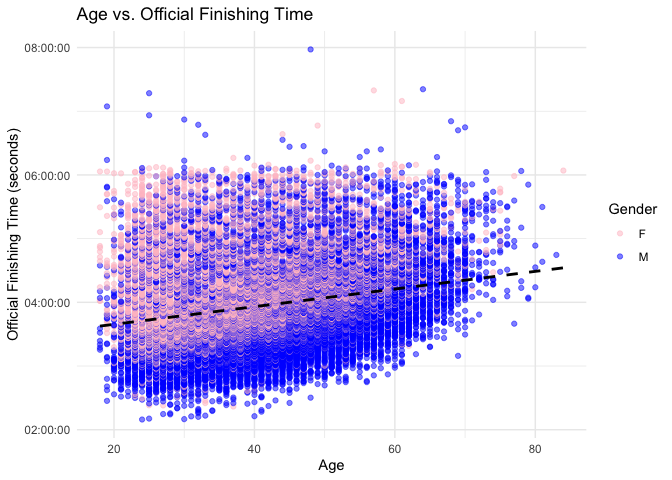

```r
#Loading libraries
library(tidyverse)
```

```
## ── Attaching core tidyverse packages ──────────────────────── tidyverse 2.0.0 ──
## ✔ dplyr     1.1.4     ✔ readr     2.1.5
## ✔ forcats   1.0.0     ✔ stringr   1.5.1
## ✔ ggplot2   3.4.4     ✔ tibble    3.2.1
## ✔ lubridate 1.9.3     ✔ tidyr     1.3.0
## ✔ purrr     1.0.2     
## ── Conflicts ────────────────────────────────────────── tidyverse_conflicts() ──
## ✖ dplyr::filter() masks stats::filter()
## ✖ dplyr::lag()    masks stats::lag()
## ℹ Use the conflicted package (<http://conflicted.r-lib.org/>) to force all conflicts to become errors
```

```r
library(ggplot2)
```


```r
# Loading data
marathon_results<-read_csv("/Users/prathyushabhuma/Documents/Florida Polytechnic University/Data Visualization and Reproducible Research/dataviz_final_project/data/marathon_results_2017.csv")
```

```
## Warning: One or more parsing issues, call `problems()` on your data frame for details,
## e.g.:
##   dat <- vroom(...)
##   problems(dat)
```

```
## Rows: 26410 Columns: 22
## ── Column specification ────────────────────────────────────────────────────────
## Delimiter: ","
## chr  (10): Bib, Name, M/F, City, State, Country, 10K, 15K, 20K, Proj Time
## dbl   (4): Age, Overall, Gender, Division
## time  (8): 5K, Half, 25K, 30K, 35K, 40K, Pace, Official Time
## 
## ℹ Use `spec()` to retrieve the full column specification for this data.
## ℹ Specify the column types or set `show_col_types = FALSE` to quiet this message.
```

```r
#dimensions 
dim(marathon_results)
```

```
## [1] 26410    22
```


```r
head(marathon_results)
```

```
## # A tibble: 6 × 22
##   Bib   Name     Age `M/F` City  State Country `5K`   `10K` `15K` `20K` Half    
##   <chr> <chr>  <dbl> <chr> <chr> <chr> <chr>   <time> <chr> <chr> <chr> <time>  
## 1 11    Kirui…    24 M     Keri… <NA>  KEN     15'25" 0:30… 0:45… 1:01… 01:04:35
## 2 17    Rupp,…    30 M     Port… OR    USA     15'24" 0:30… 0:45… 1:01… 01:04:35
## 3 23    Osako…    25 M     Mach… <NA>  JPN     15'25" 0:30… 0:45… 1:01… 01:04:36
## 4 21    Biwot…    32 M     Mamm… CA    USA     15'25" 0:30… 0:45… 1:01… 01:04:45
## 5 9     Chebe…    31 M     Mara… <NA>  KEN     15'25" 0:30… 0:45… 1:01… 01:04:35
## 6 15    Abdir…    40 M     Phoe… AZ    USA     15'25" 0:30… 0:45… 1:01… 01:04:35
## # ℹ 10 more variables: `25K` <time>, `30K` <time>, `35K` <time>, `40K` <time>,
## #   Pace <time>, `Proj Time` <chr>, `Official Time` <time>, Overall <dbl>,
## #   Gender <dbl>, Division <dbl>
```

```r
# Count the number of Finishers by Gender
Finishers_by_gender <- table(marathon_results$`M/F`)
```


```r
Finishers_by_gender
```

```
## 
##     F     M 
## 11972 14438
```


```r
# Convert the Finishers count to a data frame
Finishers_df <- as.data.frame(Finishers_by_gender)

# Rename the columns for clarity
colnames(Finishers_df) <- c("Gender", "Count")
```


```r
Finishers_df
```

```
##   Gender Count
## 1      F 11972
## 2      M 14438
```


```r
# Create a pie chart
ggplot(Finishers_df, aes(x = "", y = Count, fill = Gender)) +
  geom_bar(stat = "identity", width = 1) +
  coord_polar("y", start = 0) +
  labs(title = "Distribution of Finishers by Gender") +
  scale_fill_manual(values = c("blue", "pink")) +  # Customizing fill colors for genders
  theme_void()  # Removing unnecessary elements like axes and grid lines
```

<!-- -->

```r
# Group the data by country and calculate the average finishing time for each country
country_avg_time <- marathon_results %>%
  group_by(Country) %>%
  summarise(avg_time=mean(`Official Time`))

# Sort the countries based on the average finishing time in Ascending order
sorted_countries <- country_avg_time %>%
  arrange(avg_time)
sorted_countries
```

```
## # A tibble: 91 × 2
##    Country avg_time     
##    <chr>   <drtn>       
##  1 ZIM      8260.00 secs
##  2 KEN      8479.25 secs
##  3 BRN      8571.00 secs
##  4 ETH      8828.80 secs
##  5 BDI      9144.00 secs
##  6 PAN     10982.25 secs
##  7 FLK     11424.00 secs
##  8 JAM     11520.00 secs
##  9 SRB     11601.00 secs
## 10 MLT     11666.00 secs
## # ℹ 81 more rows
```


```r
# Select the top 5 countries with the fastest runners
top_5_countries <- head(sorted_countries, 5)

#Create a bar plot for the top 5 countries with the fastest runners
ggplot(top_5_countries, aes(x = reorder(Country, avg_time) , y = avg_time )) +
  geom_bar(stat = "identity", fill = "steelblue") +
  labs(title = "Top 5 Countries with the Fastest Runners",
       x = "Country",
       y = "Average Finishing Time") +
  theme(axis.text.x = element_text(angle = 45, hjust = 1))+
  theme_minimal()
```

```
## Don't know how to automatically pick scale for object of type <difftime>.
## Defaulting to continuous.
```

<!-- -->


```r
# Count the number of Finishers from each country
Finishers_by_country <- marathon_results %>%
  group_by(Country) %>%
  summarise(Num_Finishers = n()) 


# View the count of participants from each country
print(Finishers_by_country)
```

```
## # A tibble: 91 × 2
##    Country Num_Finishers
##    <chr>           <int>
##  1 ALG                 2
##  2 AND                 1
##  3 ARG                36
##  4 AUS               191
##  5 AUT                22
##  6 BAR                 4
##  7 BDI                 1
##  8 BEL                42
##  9 BER                 3
## 10 BRA               205
## # ℹ 81 more rows
```


```r
# Select the top 10 countries with the More Number of Participants
top_10_countries<-arrange(Finishers_by_country, desc(Num_Finishers))
top_10_countries
```

```
## # A tibble: 91 × 2
##    Country Num_Finishers
##    <chr>           <int>
##  1 USA             20945
##  2 CAN              1870
##  3 GBR               425
##  4 MEX               285
##  5 CHN               242
##  6 GER               226
##  7 BRA               205
##  8 AUS               191
##  9 JPN               170
## 10 ITA               165
## # ℹ 81 more rows
```


```r
Top_10<-head(top_10_countries,10)
Top_10
```

```
## # A tibble: 10 × 2
##    Country Num_Finishers
##    <chr>           <int>
##  1 USA             20945
##  2 CAN              1870
##  3 GBR               425
##  4 MEX               285
##  5 CHN               242
##  6 GER               226
##  7 BRA               205
##  8 AUS               191
##  9 JPN               170
## 10 ITA               165
```


```r
# Create a lollipop chart
ggplot(Top_10,
       aes(x = Country, y = Num_Finishers , 
           color = Country)) +
  geom_pointrange(aes(ymin = 0, ymax = Num_Finishers)) +
  guides(color = FALSE) +
  labs(title = "Number of Finishers by Country",
       x = "Country",
       y = "Number of Finishers" )+
  theme_minimal() +
  theme(axis.text.x = element_text(angle = 45, hjust = 1, vjust = 1))
```

```
## Warning: The `<scale>` argument of `guides()` cannot be `FALSE`. Use "none" instead as
## of ggplot2 3.3.4.
## This warning is displayed once every 8 hours.
## Call `lifecycle::last_lifecycle_warnings()` to see where this warning was
## generated.
```

<!-- -->

```r
# Create a histogram to visualize the distribution of Finishers ages
ggplot(marathon_results, aes(x = Age)) +
  geom_histogram(binwidth = 5, fill = "blue", color = "black", alpha = 0.7) +
  labs(title = "Distribution of Finishers Ages",
       x = "Age",
       y = "Number of Finishers") +
  theme_minimal()
```

<!-- -->


```r
# Create a boxplot to visualize the distribution of Finishers ages by gender
ggplot(marathon_results, aes(x =`M/F`,y = Age, fill =`M/F`)) +
  geom_boxplot(alpha = 0.3) +
  labs(title = "Age Distribution based on Gender",
       x = "Gender",
       y = "Age") +
  theme_minimal()
```

<!-- -->


```r
# Extension to the original mini project that was submitted earlier with a new visualization
ggplot(marathon_results, aes(x = Age, y = `Official Time`, color = `M/F`)) +
  geom_point(alpha = 0.5) +
  geom_smooth(method = "lm", se = FALSE, color = "black", linetype = "dashed") +
  labs(title = "Age vs. Official Finishing Time",
       x = "Age",
       y = "Official Finishing Time (seconds)",
       color = "Gender") +
  scale_color_manual(values = c("M" = "blue", "F" = "pink")) +
  theme_minimal()
```

```
## `geom_smooth()` using formula = 'y ~ x'
```

<!-- -->

Comment: The scatter plot enables us to explore the relationship between the official finishing times and the ages of the marathon participants. This can provide insights into whether certain age groups tend to finish faster or slower on average. Also, it will allow us to visualize how the finishing times vary with age and whether there are noticeable differences between genders in this aspect.
