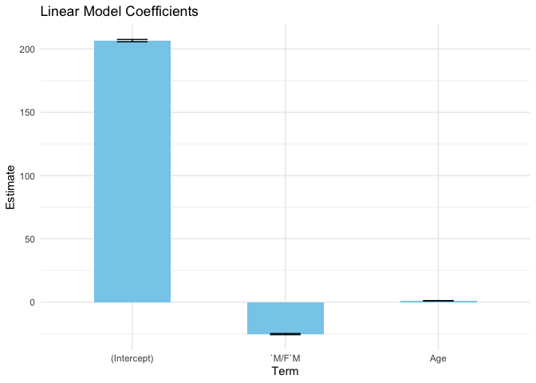

```r
#Loading libraries
library(tidyverse)
```

```
## ── Attaching core tidyverse packages ──────────────────────── tidyverse 2.0.0 ──
## ✔ dplyr     1.1.4     ✔ readr     2.1.5
## ✔ forcats   1.0.0     ✔ stringr   1.5.1
## ✔ ggplot2   3.4.4     ✔ tibble    3.2.1
## ✔ lubridate 1.9.3     ✔ tidyr     1.3.0
## ✔ purrr     1.0.2     
## ── Conflicts ────────────────────────────────────────── tidyverse_conflicts() ──
## ✖ dplyr::filter() masks stats::filter()
## ✖ dplyr::lag()    masks stats::lag()
## ℹ Use the conflicted package (<http://conflicted.r-lib.org/>) to force all conflicts to become errors
```

```r
library(ggplot2)
library(plotly)
```

```
## 
## Attaching package: 'plotly'
## 
## The following object is masked from 'package:ggplot2':
## 
##     last_plot
## 
## The following object is masked from 'package:stats':
## 
##     filter
## 
## The following object is masked from 'package:graphics':
## 
##     layout
```

```r
library(sf)
```

```
## Linking to GEOS 3.11.0, GDAL 3.5.3, PROJ 9.1.0; sf_use_s2() is TRUE
```

```r
library(maps)
```

```
## 
## Attaching package: 'maps'
## 
## The following object is masked from 'package:purrr':
## 
##     map
```

```r
library(broom)
```


```r
# Loading data
marathon_results<-read_csv("/Users/prathyushabhuma/Documents/Florida Polytechnic University/Data Visualization and Reproducible Research/dataviz_final_project/data/marathon_results_2017.csv")
```

```
## Warning: One or more parsing issues, call `problems()` on your data frame for details,
## e.g.:
##   dat <- vroom(...)
##   problems(dat)
```

```
## Rows: 26410 Columns: 22
## ── Column specification ────────────────────────────────────────────────────────
## Delimiter: ","
## chr  (10): Bib, Name, M/F, City, State, Country, 10K, 15K, 20K, Proj Time
## dbl   (4): Age, Overall, Gender, Division
## time  (8): 5K, Half, 25K, 30K, 35K, 40K, Pace, Official Time
## 
## ℹ Use `spec()` to retrieve the full column specification for this data.
## ℹ Specify the column types or set `show_col_types = FALSE` to quiet this message.
```

```r
#dimensions 
dim(marathon_results)
```

```
## [1] 26410    22
```


```r
head(marathon_results)
```

<div data-pagedtable="false">
  <script data-pagedtable-source type="application/json">
{"columns":[{"label":["Bib"],"name":[1],"type":["chr"],"align":["left"]},{"label":["Name"],"name":[2],"type":["chr"],"align":["left"]},{"label":["Age"],"name":[3],"type":["dbl"],"align":["right"]},{"label":["M/F"],"name":[4],"type":["chr"],"align":["left"]},{"label":["City"],"name":[5],"type":["chr"],"align":["left"]},{"label":["State"],"name":[6],"type":["chr"],"align":["left"]},{"label":["Country"],"name":[7],"type":["chr"],"align":["left"]},{"label":["5K"],"name":[8],"type":["time"],"align":["right"]},{"label":["10K"],"name":[9],"type":["chr"],"align":["left"]},{"label":["15K"],"name":[10],"type":["chr"],"align":["left"]},{"label":["20K"],"name":[11],"type":["chr"],"align":["left"]},{"label":["Half"],"name":[12],"type":["time"],"align":["right"]},{"label":["25K"],"name":[13],"type":["time"],"align":["right"]},{"label":["30K"],"name":[14],"type":["time"],"align":["right"]},{"label":["35K"],"name":[15],"type":["time"],"align":["right"]},{"label":["40K"],"name":[16],"type":["time"],"align":["right"]},{"label":["Pace"],"name":[17],"type":["time"],"align":["right"]},{"label":["Proj Time"],"name":[18],"type":["chr"],"align":["left"]},{"label":["Official Time"],"name":[19],"type":["time"],"align":["right"]},{"label":["Overall"],"name":[20],"type":["dbl"],"align":["right"]},{"label":["Gender"],"name":[21],"type":["dbl"],"align":["right"]},{"label":["Division"],"name":[22],"type":["dbl"],"align":["right"]}],"data":[{"1":"11","2":"Kirui, Geoffrey","3":"24","4":"M","5":"Keringet","6":"NA","7":"KEN","8":"00:15:25","9":"0:30:28","10":"0:45:44","11":"1:01:15","12":"01:04:35","13":"01:16:59","14":"01:33:01","15":"01:48:19","16":"02:02:53","17":"00:04:57","18":"-","19":"02:09:37","20":"1","21":"1","22":"1"},{"1":"17","2":"Rupp, Galen","3":"30","4":"M","5":"Portland","6":"OR","7":"USA","8":"00:15:24","9":"0:30:27","10":"0:45:44","11":"1:01:15","12":"01:04:35","13":"01:16:59","14":"01:33:01","15":"01:48:19","16":"02:03:14","17":"00:04:58","18":"-","19":"02:09:58","20":"2","21":"2","22":"2"},{"1":"23","2":"Osako, Suguru","3":"25","4":"M","5":"Machida-City","6":"NA","7":"JPN","8":"00:15:25","9":"0:30:29","10":"0:45:44","11":"1:01:16","12":"01:04:36","13":"01:17:00","14":"01:33:01","15":"01:48:31","16":"02:03:38","17":"00:04:59","18":"-","19":"02:10:28","20":"3","21":"3","22":"3"},{"1":"21","2":"Biwott, Shadrack","3":"32","4":"M","5":"Mammoth Lakes","6":"CA","7":"USA","8":"00:15:25","9":"0:30:29","10":"0:45:44","11":"1:01:19","12":"01:04:45","13":"01:17:00","14":"01:33:01","15":"01:48:58","16":"02:04:35","17":"00:05:03","18":"-","19":"02:12:08","20":"4","21":"4","22":"4"},{"1":"9","2":"Chebet, Wilson","3":"31","4":"M","5":"Marakwet","6":"NA","7":"KEN","8":"00:15:25","9":"0:30:28","10":"0:45:44","11":"1:01:15","12":"01:04:35","13":"01:16:59","14":"01:33:01","15":"01:48:41","16":"02:05:00","17":"00:05:04","18":"-","19":"02:12:35","20":"5","21":"5","22":"5"},{"1":"15","2":"Abdirahman, Abdi","3":"40","4":"M","5":"Phoenix","6":"AZ","7":"USA","8":"00:15:25","9":"0:30:28","10":"0:45:44","11":"1:01:15","12":"01:04:35","13":"01:16:59","14":"01:33:01","15":"01:48:52","16":"02:05:21","17":"00:05:04","18":"-","19":"02:12:45","20":"6","21":"6","22":"1"}],"options":{"columns":{"min":{},"max":[10]},"rows":{"min":[10],"max":[10]},"pages":{}}}
  </script>
</div>


```r
# Display the structure  of the dataset
str(marathon_results)
```

```
## spc_tbl_ [26,410 × 22] (S3: spec_tbl_df/tbl_df/tbl/data.frame)
##  $ Bib          : chr [1:26410] "11" "17" "23" "21" ...
##  $ Name         : chr [1:26410] "Kirui, Geoffrey" "Rupp, Galen" "Osako, Suguru" "Biwott, Shadrack" ...
##  $ Age          : num [1:26410] 24 30 25 32 31 40 33 28 27 28 ...
##  $ M/F          : chr [1:26410] "M" "M" "M" "M" ...
##  $ City         : chr [1:26410] "Keringet" "Portland" "Machida-City" "Mammoth Lakes" ...
##  $ State        : chr [1:26410] NA "OR" NA "CA" ...
##  $ Country      : chr [1:26410] "KEN" "USA" "JPN" "USA" ...
##  $ 5K           : 'hms' num [1:26410] 00:15:25 00:15:24 00:15:25 00:15:25 ...
##   ..- attr(*, "units")= chr "secs"
##  $ 10K          : chr [1:26410] "0:30:28" "0:30:27" "0:30:29" "0:30:29" ...
##  $ 15K          : chr [1:26410] "0:45:44" "0:45:44" "0:45:44" "0:45:44" ...
##  $ 20K          : chr [1:26410] "1:01:15" "1:01:15" "1:01:16" "1:01:19" ...
##  $ Half         : 'hms' num [1:26410] 01:04:35 01:04:35 01:04:36 01:04:45 ...
##   ..- attr(*, "units")= chr "secs"
##  $ 25K          : 'hms' num [1:26410] 01:16:59 01:16:59 01:17:00 01:17:00 ...
##   ..- attr(*, "units")= chr "secs"
##  $ 30K          : 'hms' num [1:26410] 01:33:01 01:33:01 01:33:01 01:33:01 ...
##   ..- attr(*, "units")= chr "secs"
##  $ 35K          : 'hms' num [1:26410] 01:48:19 01:48:19 01:48:31 01:48:58 ...
##   ..- attr(*, "units")= chr "secs"
##  $ 40K          : 'hms' num [1:26410] 02:02:53 02:03:14 02:03:38 02:04:35 ...
##   ..- attr(*, "units")= chr "secs"
##  $ Pace         : 'hms' num [1:26410] 00:04:57 00:04:58 00:04:59 00:05:03 ...
##   ..- attr(*, "units")= chr "secs"
##  $ Proj Time    : chr [1:26410] "-" "-" "-" "-" ...
##  $ Official Time: 'hms' num [1:26410] 02:09:37 02:09:58 02:10:28 02:12:08 ...
##   ..- attr(*, "units")= chr "secs"
##  $ Overall      : num [1:26410] 1 2 3 4 5 6 7 8 9 10 ...
##  $ Gender       : num [1:26410] 1 2 3 4 5 6 7 8 9 10 ...
##  $ Division     : num [1:26410] 1 2 3 4 5 1 6 7 8 9 ...
##  - attr(*, "spec")=
##   .. cols(
##   ..   Bib = col_character(),
##   ..   Name = col_character(),
##   ..   Age = col_double(),
##   ..   `M/F` = col_character(),
##   ..   City = col_character(),
##   ..   State = col_character(),
##   ..   Country = col_character(),
##   ..   `5K` = col_time(format = ""),
##   ..   `10K` = col_character(),
##   ..   `15K` = col_character(),
##   ..   `20K` = col_character(),
##   ..   Half = col_time(format = ""),
##   ..   `25K` = col_time(format = ""),
##   ..   `30K` = col_time(format = ""),
##   ..   `35K` = col_time(format = ""),
##   ..   `40K` = col_time(format = ""),
##   ..   Pace = col_time(format = ""),
##   ..   `Proj Time` = col_character(),
##   ..   `Official Time` = col_time(format = ""),
##   ..   Overall = col_double(),
##   ..   Gender = col_double(),
##   ..   Division = col_double()
##   .. )
##  - attr(*, "problems")=<externalptr>
```

```r
# Display the  summary of the dataset
summary(marathon_results)
```

```
##      Bib                Name                Age            M/F           
##  Length:26410       Length:26410       Min.   :18.00   Length:26410      
##  Class :character   Class :character   1st Qu.:34.00   Class :character  
##  Mode  :character   Mode  :character   Median :43.00   Mode  :character  
##                                        Mean   :42.59                     
##                                        3rd Qu.:51.00                     
##                                        Max.   :84.00                     
##      City              State             Country               5K          
##  Length:26410       Length:26410       Length:26410       Length:26410     
##  Class :character   Class :character   Class :character   Class1:hms       
##  Mode  :character   Mode  :character   Mode  :character   Class2:difftime  
##                                                           Mode  :numeric   
##                                                                            
##                                                                            
##      10K                15K                20K                Half         
##  Length:26410       Length:26410       Length:26410       Length:26410     
##  Class :character   Class :character   Class :character   Class1:hms       
##  Mode  :character   Mode  :character   Mode  :character   Class2:difftime  
##                                                           Mode  :numeric   
##                                                                            
##                                                                            
##      25K               30K               35K               40K          
##  Length:26410      Length:26410      Length:26410      Length:26410     
##  Class1:hms        Class1:hms        Class1:hms        Class1:hms       
##  Class2:difftime   Class2:difftime   Class2:difftime   Class2:difftime  
##  Mode  :numeric    Mode  :numeric    Mode  :numeric    Mode  :numeric   
##                                                                         
##                                                                         
##      Pace           Proj Time         Official Time        Overall     
##  Length:26410      Length:26410       Length:26410      Min.   :    1  
##  Class1:hms        Class :character   Class1:hms        1st Qu.: 6604  
##  Class2:difftime   Mode  :character   Class2:difftime   Median :13206  
##  Mode  :numeric                       Mode  :numeric    Mean   :13206  
##                                                         3rd Qu.:19809  
##                                                         Max.   :26411  
##      Gender         Division   
##  Min.   :    1   Min.   :   1  
##  1st Qu.: 3302   1st Qu.: 502  
##  Median : 6604   Median :1154  
##  Mean   : 6661   Mean   :1589  
##  3rd Qu.: 9905   3rd Qu.:2191  
##  Max.   :14438   Max.   :5846
```


```r
colSums(is.na(marathon_results))
```

```
##           Bib          Name           Age           M/F          City 
##             0             0             0             0             0 
##         State       Country            5K           10K           15K 
##          3595             0            25             0             0 
##           20K          Half           25K           30K           35K 
##             0            17            40            25            23 
##           40K          Pace     Proj Time Official Time       Overall 
##             6             0             0             0             0 
##        Gender      Division 
##             0             0
```


```r
# 1. Interactive Plot
# Plot distribution of marathon finish times
finish_time_plot <- ggplot(marathon_results, aes(x = `Official Time`)) +
  geom_histogram(binwidth = 300, fill = "blue", color = "white") +
  labs(title = "Distribution of Marathon Finish Times", x = "Finish Time", y = "Count")

finish_time_plot
```

<!-- -->

```r
# Convert to interactive plot using plotly
interactive_finish_time_plot <- ggplotly(finish_time_plot)
interactive_finish_time_plot
```

```{=html}
<div class="plotly html-widget html-fill-item" id="htmlwidget-d1d4910dcf148ddb7f90" style="width:672px;height:480px;"></div>
<script type="application/json" data-for="htmlwidget-d1d4910dcf148ddb7f90">{"x":{"data":[{"orientation":"v","width":[300,300,300,300,300,300,300,300,300,300,300,300,300,300,300,300,300,300,300,300,300,300,300,300,300,300,300,300,300,300,300,300,300,300,300,300,300,300,300,300,300,300,300,300,300,300,300,300,300,300,300,300,300,300,300,300,300,300,300,300,300,300,300,300,300,300,300,300,300,300,300],"base":[0,0,0,0,0,0,0,0,0,0,0,0,0,0,0,0,0,0,0,0,0,0,0,0,0,0,0,0,0,0,0,0,0,0,0,0,0,0,0,0,0,0,0,0,0,0,0,0,0,0,0,0,0,0,0,0,0,0,0,0,0,0,0,0,0,0,0,0,0,0,0],"x":[7800,8100,8400,8700,9000,9300,9600,9900,10200,10500,10800,11100,11400,11700,12000,12300,12600,12900,13200,13500,13800,14100,14400,14700,15000,15300,15600,15900,16200,16500,16800,17100,17400,17700,18000,18300,18600,18900,19200,19500,19800,20100,20400,20700,21000,21300,21600,21900,22200,22500,22800,23100,23400,23700,24000,24300,24600,24900,25200,25500,25800,26100,26400,26700,27000,27300,27600,27900,28200,28500,28800],"y":[4,9,9,22,33,57,104,209,278,399,592,662,850,908,1048,1195,1311,1375,1380,1490,1504,1471,1254,1015,1005,883,866,725,669,593,484,504,422,410,372,296,262,253,232,235,188,155,143,110,131,118,84,54,9,7,2,3,0,1,3,3,2,1,0,1,1,1,2,0,0,0,0,0,0,0,1],"text":["count:    4<br />Official Time:  7800","count:    9<br />Official Time:  8100","count:    9<br />Official Time:  8400","count:   22<br />Official Time:  8700","count:   33<br />Official Time:  9000","count:   57<br />Official Time:  9300","count:  104<br />Official Time:  9600","count:  209<br />Official Time:  9900","count:  278<br />Official Time: 10200","count:  399<br />Official Time: 10500","count:  592<br />Official Time: 10800","count:  662<br />Official Time: 11100","count:  850<br />Official Time: 11400","count:  908<br />Official Time: 11700","count: 1048<br />Official Time: 12000","count: 1195<br />Official Time: 12300","count: 1311<br />Official Time: 12600","count: 1375<br />Official Time: 12900","count: 1380<br />Official Time: 13200","count: 1490<br />Official Time: 13500","count: 1504<br />Official Time: 13800","count: 1471<br />Official Time: 14100","count: 1254<br />Official Time: 14400","count: 1015<br />Official Time: 14700","count: 1005<br />Official Time: 15000","count:  883<br />Official Time: 15300","count:  866<br />Official Time: 15600","count:  725<br />Official Time: 15900","count:  669<br />Official Time: 16200","count:  593<br />Official Time: 16500","count:  484<br />Official Time: 16800","count:  504<br />Official Time: 17100","count:  422<br />Official Time: 17400","count:  410<br />Official Time: 17700","count:  372<br />Official Time: 18000","count:  296<br />Official Time: 18300","count:  262<br />Official Time: 18600","count:  253<br />Official Time: 18900","count:  232<br />Official Time: 19200","count:  235<br />Official Time: 19500","count:  188<br />Official Time: 19800","count:  155<br />Official Time: 20100","count:  143<br />Official Time: 20400","count:  110<br />Official Time: 20700","count:  131<br />Official Time: 21000","count:  118<br />Official Time: 21300","count:   84<br />Official Time: 21600","count:   54<br />Official Time: 21900","count:    9<br />Official Time: 22200","count:    7<br />Official Time: 22500","count:    2<br />Official Time: 22800","count:    3<br />Official Time: 23100","count:    0<br />Official Time: 23400","count:    1<br />Official Time: 23700","count:    3<br />Official Time: 24000","count:    3<br />Official Time: 24300","count:    2<br />Official Time: 24600","count:    1<br />Official Time: 24900","count:    0<br />Official Time: 25200","count:    1<br />Official Time: 25500","count:    1<br />Official Time: 25800","count:    1<br />Official Time: 26100","count:    2<br />Official Time: 26400","count:    0<br />Official Time: 26700","count:    0<br />Official Time: 27000","count:    0<br />Official Time: 27300","count:    0<br />Official Time: 27600","count:    0<br />Official Time: 27900","count:    0<br />Official Time: 28200","count:    0<br />Official Time: 28500","count:    1<br />Official Time: 28800"],"type":"bar","textposition":"none","marker":{"autocolorscale":false,"color":"rgba(0,0,255,1)","line":{"width":1.8897637795275593,"color":"rgba(255,255,255,1)"}},"showlegend":false,"xaxis":"x","yaxis":"y","hoverinfo":"text","frame":null}],"layout":{"margin":{"t":43.762557077625573,"r":7.3059360730593621,"b":40.182648401826498,"l":48.949771689497723},"plot_bgcolor":"rgba(235,235,235,1)","paper_bgcolor":"rgba(255,255,255,1)","font":{"color":"rgba(0,0,0,1)","family":"","size":14.611872146118724},"title":{"text":"Distribution of Marathon Finish Times","font":{"color":"rgba(0,0,0,1)","family":"","size":17.534246575342465},"x":0,"xref":"paper"},"xaxis":{"domain":[0,1],"automargin":true,"type":"linear","autorange":false,"range":[6585,30015],"tickmode":"array","ticktext":["02:00:00","04:00:00","06:00:00","08:00:00"],"tickvals":[7200,14400,21600,28800],"categoryorder":"array","categoryarray":["02:00:00","04:00:00","06:00:00","08:00:00"],"nticks":null,"ticks":"outside","tickcolor":"rgba(51,51,51,1)","ticklen":3.6529680365296811,"tickwidth":0.66417600664176002,"showticklabels":true,"tickfont":{"color":"rgba(77,77,77,1)","family":"","size":11.68949771689498},"tickangle":-0,"showline":false,"linecolor":null,"linewidth":0,"showgrid":true,"gridcolor":"rgba(255,255,255,1)","gridwidth":0.66417600664176002,"zeroline":false,"anchor":"y","title":{"text":"Finish Time","font":{"color":"rgba(0,0,0,1)","family":"","size":14.611872146118724}},"hoverformat":".2f"},"yaxis":{"domain":[0,1],"automargin":true,"type":"linear","autorange":false,"range":[-75.200000000000003,1579.2],"tickmode":"array","ticktext":["0","500","1000","1500"],"tickvals":[0,500.00000000000006,1000,1500],"categoryorder":"array","categoryarray":["0","500","1000","1500"],"nticks":null,"ticks":"outside","tickcolor":"rgba(51,51,51,1)","ticklen":3.6529680365296811,"tickwidth":0.66417600664176002,"showticklabels":true,"tickfont":{"color":"rgba(77,77,77,1)","family":"","size":11.68949771689498},"tickangle":-0,"showline":false,"linecolor":null,"linewidth":0,"showgrid":true,"gridcolor":"rgba(255,255,255,1)","gridwidth":0.66417600664176002,"zeroline":false,"anchor":"x","title":{"text":"Count","font":{"color":"rgba(0,0,0,1)","family":"","size":14.611872146118724}},"hoverformat":".2f"},"shapes":[{"type":"rect","fillcolor":null,"line":{"color":null,"width":0,"linetype":[]},"yref":"paper","xref":"paper","x0":0,"x1":1,"y0":0,"y1":1}],"showlegend":false,"legend":{"bgcolor":"rgba(255,255,255,1)","bordercolor":"transparent","borderwidth":1.8897637795275593,"font":{"color":"rgba(0,0,0,1)","family":"","size":11.68949771689498}},"hovermode":"closest","barmode":"relative"},"config":{"doubleClick":"reset","modeBarButtonsToAdd":["hoverclosest","hovercompare"],"showSendToCloud":false},"source":"A","attrs":{"7e23ea1ed63":{"x":{},"type":"bar"}},"cur_data":"7e23ea1ed63","visdat":{"7e23ea1ed63":["function (y) ","x"]},"highlight":{"on":"plotly_click","persistent":false,"dynamic":false,"selectize":false,"opacityDim":0.20000000000000001,"selected":{"opacity":1},"debounce":0},"shinyEvents":["plotly_hover","plotly_click","plotly_selected","plotly_relayout","plotly_brushed","plotly_brushing","plotly_clickannotation","plotly_doubleclick","plotly_deselect","plotly_afterplot","plotly_sunburstclick"],"base_url":"https://plot.ly"},"evals":[],"jsHooks":[]}</script>
```

```r
# Save the interactive plot as an HTML file
htmlwidgets::saveWidget(interactive_finish_time_plot, "interactive_finish_time_plot.html")
```

`

```r
# Load world shapefile from Natural Earth
# https://www.naturalearthdata.com/downloads/110m-cultural-vectors/
world_shapes <- read_sf("/Users/prathyushabhuma/Documents/Florida Polytechnic University/Data Visualization and Reproducible Research/MiniProject2/Data/ne_110m_admin_0_countries")
```


```r
head(world_shapes)
```

<div data-pagedtable="false">
  <script data-pagedtable-source type="application/json">
{"columns":[{"label":["featurecla"],"name":[1],"type":["chr"],"align":["left"]},{"label":["scalerank"],"name":[2],"type":["int"],"align":["right"]},{"label":["LABELRANK"],"name":[3],"type":["int"],"align":["right"]},{"label":["SOVEREIGNT"],"name":[4],"type":["chr"],"align":["left"]},{"label":["SOV_A3"],"name":[5],"type":["chr"],"align":["left"]},{"label":["ADM0_DIF"],"name":[6],"type":["int"],"align":["right"]},{"label":["LEVEL"],"name":[7],"type":["int"],"align":["right"]},{"label":["TYPE"],"name":[8],"type":["chr"],"align":["left"]},{"label":["TLC"],"name":[9],"type":["chr"],"align":["left"]},{"label":["ADMIN"],"name":[10],"type":["chr"],"align":["left"]},{"label":["ADM0_A3"],"name":[11],"type":["chr"],"align":["left"]},{"label":["GEOU_DIF"],"name":[12],"type":["int"],"align":["right"]},{"label":["GEOUNIT"],"name":[13],"type":["chr"],"align":["left"]},{"label":["GU_A3"],"name":[14],"type":["chr"],"align":["left"]},{"label":["SU_DIF"],"name":[15],"type":["int"],"align":["right"]},{"label":["SUBUNIT"],"name":[16],"type":["chr"],"align":["left"]},{"label":["SU_A3"],"name":[17],"type":["chr"],"align":["left"]},{"label":["BRK_DIFF"],"name":[18],"type":["int"],"align":["right"]},{"label":["NAME"],"name":[19],"type":["chr"],"align":["left"]},{"label":["NAME_LONG"],"name":[20],"type":["chr"],"align":["left"]},{"label":["BRK_A3"],"name":[21],"type":["chr"],"align":["left"]},{"label":["BRK_NAME"],"name":[22],"type":["chr"],"align":["left"]},{"label":["BRK_GROUP"],"name":[23],"type":["chr"],"align":["left"]},{"label":["ABBREV"],"name":[24],"type":["chr"],"align":["left"]},{"label":["POSTAL"],"name":[25],"type":["chr"],"align":["left"]},{"label":["FORMAL_EN"],"name":[26],"type":["chr"],"align":["left"]},{"label":["FORMAL_FR"],"name":[27],"type":["chr"],"align":["left"]},{"label":["NAME_CIAWF"],"name":[28],"type":["chr"],"align":["left"]},{"label":["NOTE_ADM0"],"name":[29],"type":["chr"],"align":["left"]},{"label":["NOTE_BRK"],"name":[30],"type":["chr"],"align":["left"]},{"label":["NAME_SORT"],"name":[31],"type":["chr"],"align":["left"]},{"label":["NAME_ALT"],"name":[32],"type":["chr"],"align":["left"]},{"label":["MAPCOLOR7"],"name":[33],"type":["int"],"align":["right"]},{"label":["MAPCOLOR8"],"name":[34],"type":["int"],"align":["right"]},{"label":["MAPCOLOR9"],"name":[35],"type":["int"],"align":["right"]},{"label":["MAPCOLOR13"],"name":[36],"type":["int"],"align":["right"]},{"label":["POP_EST"],"name":[37],"type":["dbl"],"align":["right"]},{"label":["POP_RANK"],"name":[38],"type":["int"],"align":["right"]},{"label":["POP_YEAR"],"name":[39],"type":["int"],"align":["right"]},{"label":["GDP_MD"],"name":[40],"type":["int"],"align":["right"]},{"label":["GDP_YEAR"],"name":[41],"type":["int"],"align":["right"]},{"label":["ECONOMY"],"name":[42],"type":["chr"],"align":["left"]},{"label":["INCOME_GRP"],"name":[43],"type":["chr"],"align":["left"]},{"label":["FIPS_10"],"name":[44],"type":["chr"],"align":["left"]},{"label":["ISO_A2"],"name":[45],"type":["chr"],"align":["left"]},{"label":["ISO_A2_EH"],"name":[46],"type":["chr"],"align":["left"]},{"label":["ISO_A3"],"name":[47],"type":["chr"],"align":["left"]},{"label":["ISO_A3_EH"],"name":[48],"type":["chr"],"align":["left"]},{"label":["ISO_N3"],"name":[49],"type":["chr"],"align":["left"]},{"label":["ISO_N3_EH"],"name":[50],"type":["chr"],"align":["left"]},{"label":["UN_A3"],"name":[51],"type":["chr"],"align":["left"]},{"label":["WB_A2"],"name":[52],"type":["chr"],"align":["left"]},{"label":["WB_A3"],"name":[53],"type":["chr"],"align":["left"]},{"label":["WOE_ID"],"name":[54],"type":["int"],"align":["right"]},{"label":["WOE_ID_EH"],"name":[55],"type":["int"],"align":["right"]},{"label":["WOE_NOTE"],"name":[56],"type":["chr"],"align":["left"]},{"label":["ADM0_ISO"],"name":[57],"type":["chr"],"align":["left"]},{"label":["ADM0_DIFF"],"name":[58],"type":["chr"],"align":["left"]},{"label":["ADM0_TLC"],"name":[59],"type":["chr"],"align":["left"]},{"label":["ADM0_A3_US"],"name":[60],"type":["chr"],"align":["left"]},{"label":["ADM0_A3_FR"],"name":[61],"type":["chr"],"align":["left"]},{"label":["ADM0_A3_RU"],"name":[62],"type":["chr"],"align":["left"]},{"label":["ADM0_A3_ES"],"name":[63],"type":["chr"],"align":["left"]},{"label":["ADM0_A3_CN"],"name":[64],"type":["chr"],"align":["left"]},{"label":["ADM0_A3_TW"],"name":[65],"type":["chr"],"align":["left"]},{"label":["ADM0_A3_IN"],"name":[66],"type":["chr"],"align":["left"]},{"label":["ADM0_A3_NP"],"name":[67],"type":["chr"],"align":["left"]},{"label":["ADM0_A3_PK"],"name":[68],"type":["chr"],"align":["left"]},{"label":["ADM0_A3_DE"],"name":[69],"type":["chr"],"align":["left"]},{"label":["ADM0_A3_GB"],"name":[70],"type":["chr"],"align":["left"]},{"label":["ADM0_A3_BR"],"name":[71],"type":["chr"],"align":["left"]},{"label":["ADM0_A3_IL"],"name":[72],"type":["chr"],"align":["left"]},{"label":["ADM0_A3_PS"],"name":[73],"type":["chr"],"align":["left"]},{"label":["ADM0_A3_SA"],"name":[74],"type":["chr"],"align":["left"]},{"label":["ADM0_A3_EG"],"name":[75],"type":["chr"],"align":["left"]},{"label":["ADM0_A3_MA"],"name":[76],"type":["chr"],"align":["left"]},{"label":["ADM0_A3_PT"],"name":[77],"type":["chr"],"align":["left"]},{"label":["ADM0_A3_AR"],"name":[78],"type":["chr"],"align":["left"]},{"label":["ADM0_A3_JP"],"name":[79],"type":["chr"],"align":["left"]},{"label":["ADM0_A3_KO"],"name":[80],"type":["chr"],"align":["left"]},{"label":["ADM0_A3_VN"],"name":[81],"type":["chr"],"align":["left"]},{"label":["ADM0_A3_TR"],"name":[82],"type":["chr"],"align":["left"]},{"label":["ADM0_A3_ID"],"name":[83],"type":["chr"],"align":["left"]},{"label":["ADM0_A3_PL"],"name":[84],"type":["chr"],"align":["left"]},{"label":["ADM0_A3_GR"],"name":[85],"type":["chr"],"align":["left"]},{"label":["ADM0_A3_IT"],"name":[86],"type":["chr"],"align":["left"]},{"label":["ADM0_A3_NL"],"name":[87],"type":["chr"],"align":["left"]},{"label":["ADM0_A3_SE"],"name":[88],"type":["chr"],"align":["left"]},{"label":["ADM0_A3_BD"],"name":[89],"type":["chr"],"align":["left"]},{"label":["ADM0_A3_UA"],"name":[90],"type":["chr"],"align":["left"]},{"label":["ADM0_A3_UN"],"name":[91],"type":["int"],"align":["right"]},{"label":["ADM0_A3_WB"],"name":[92],"type":["int"],"align":["right"]},{"label":["CONTINENT"],"name":[93],"type":["chr"],"align":["left"]},{"label":["REGION_UN"],"name":[94],"type":["chr"],"align":["left"]},{"label":["SUBREGION"],"name":[95],"type":["chr"],"align":["left"]},{"label":["REGION_WB"],"name":[96],"type":["chr"],"align":["left"]},{"label":["NAME_LEN"],"name":[97],"type":["int"],"align":["right"]},{"label":["LONG_LEN"],"name":[98],"type":["int"],"align":["right"]},{"label":["ABBREV_LEN"],"name":[99],"type":["int"],"align":["right"]},{"label":["TINY"],"name":[100],"type":["int"],"align":["right"]},{"label":["HOMEPART"],"name":[101],"type":["int"],"align":["right"]},{"label":["MIN_ZOOM"],"name":[102],"type":["dbl"],"align":["right"]},{"label":["MIN_LABEL"],"name":[103],"type":["dbl"],"align":["right"]},{"label":["MAX_LABEL"],"name":[104],"type":["dbl"],"align":["right"]},{"label":["LABEL_X"],"name":[105],"type":["dbl"],"align":["right"]},{"label":["LABEL_Y"],"name":[106],"type":["dbl"],"align":["right"]},{"label":["NE_ID"],"name":[107],"type":["dbl"],"align":["right"]},{"label":["WIKIDATAID"],"name":[108],"type":["chr"],"align":["left"]},{"label":["NAME_AR"],"name":[109],"type":["chr"],"align":["left"]},{"label":["NAME_BN"],"name":[110],"type":["chr"],"align":["left"]},{"label":["NAME_DE"],"name":[111],"type":["chr"],"align":["left"]},{"label":["NAME_EN"],"name":[112],"type":["chr"],"align":["left"]},{"label":["NAME_ES"],"name":[113],"type":["chr"],"align":["left"]},{"label":["NAME_FA"],"name":[114],"type":["chr"],"align":["left"]},{"label":["NAME_FR"],"name":[115],"type":["chr"],"align":["left"]},{"label":["NAME_EL"],"name":[116],"type":["chr"],"align":["left"]},{"label":["NAME_HE"],"name":[117],"type":["chr"],"align":["left"]},{"label":["NAME_HI"],"name":[118],"type":["chr"],"align":["left"]},{"label":["NAME_HU"],"name":[119],"type":["chr"],"align":["left"]},{"label":["NAME_ID"],"name":[120],"type":["chr"],"align":["left"]},{"label":["NAME_IT"],"name":[121],"type":["chr"],"align":["left"]},{"label":["NAME_JA"],"name":[122],"type":["chr"],"align":["left"]},{"label":["NAME_KO"],"name":[123],"type":["chr"],"align":["left"]},{"label":["NAME_NL"],"name":[124],"type":["chr"],"align":["left"]},{"label":["NAME_PL"],"name":[125],"type":["chr"],"align":["left"]},{"label":["NAME_PT"],"name":[126],"type":["chr"],"align":["left"]},{"label":["NAME_RU"],"name":[127],"type":["chr"],"align":["left"]},{"label":["NAME_SV"],"name":[128],"type":["chr"],"align":["left"]},{"label":["NAME_TR"],"name":[129],"type":["chr"],"align":["left"]},{"label":["NAME_UK"],"name":[130],"type":["chr"],"align":["left"]},{"label":["NAME_UR"],"name":[131],"type":["chr"],"align":["left"]},{"label":["NAME_VI"],"name":[132],"type":["chr"],"align":["left"]},{"label":["NAME_ZH"],"name":[133],"type":["chr"],"align":["left"]},{"label":["NAME_ZHT"],"name":[134],"type":["chr"],"align":["left"]},{"label":["FCLASS_ISO"],"name":[135],"type":["chr"],"align":["left"]},{"label":["TLC_DIFF"],"name":[136],"type":["chr"],"align":["left"]},{"label":["FCLASS_TLC"],"name":[137],"type":["chr"],"align":["left"]},{"label":["FCLASS_US"],"name":[138],"type":["chr"],"align":["left"]},{"label":["FCLASS_FR"],"name":[139],"type":["chr"],"align":["left"]},{"label":["FCLASS_RU"],"name":[140],"type":["chr"],"align":["left"]},{"label":["FCLASS_ES"],"name":[141],"type":["chr"],"align":["left"]},{"label":["FCLASS_CN"],"name":[142],"type":["chr"],"align":["left"]},{"label":["FCLASS_TW"],"name":[143],"type":["chr"],"align":["left"]},{"label":["FCLASS_IN"],"name":[144],"type":["chr"],"align":["left"]},{"label":["FCLASS_NP"],"name":[145],"type":["chr"],"align":["left"]},{"label":["FCLASS_PK"],"name":[146],"type":["chr"],"align":["left"]},{"label":["FCLASS_DE"],"name":[147],"type":["chr"],"align":["left"]},{"label":["FCLASS_GB"],"name":[148],"type":["chr"],"align":["left"]},{"label":["FCLASS_BR"],"name":[149],"type":["chr"],"align":["left"]},{"label":["FCLASS_IL"],"name":[150],"type":["chr"],"align":["left"]},{"label":["FCLASS_PS"],"name":[151],"type":["chr"],"align":["left"]},{"label":["FCLASS_SA"],"name":[152],"type":["chr"],"align":["left"]},{"label":["FCLASS_EG"],"name":[153],"type":["chr"],"align":["left"]},{"label":["FCLASS_MA"],"name":[154],"type":["chr"],"align":["left"]},{"label":["FCLASS_PT"],"name":[155],"type":["chr"],"align":["left"]},{"label":["FCLASS_AR"],"name":[156],"type":["chr"],"align":["left"]},{"label":["FCLASS_JP"],"name":[157],"type":["chr"],"align":["left"]},{"label":["FCLASS_KO"],"name":[158],"type":["chr"],"align":["left"]},{"label":["FCLASS_VN"],"name":[159],"type":["chr"],"align":["left"]},{"label":["FCLASS_TR"],"name":[160],"type":["chr"],"align":["left"]},{"label":["FCLASS_ID"],"name":[161],"type":["chr"],"align":["left"]},{"label":["FCLASS_PL"],"name":[162],"type":["chr"],"align":["left"]},{"label":["FCLASS_GR"],"name":[163],"type":["chr"],"align":["left"]},{"label":["FCLASS_IT"],"name":[164],"type":["chr"],"align":["left"]},{"label":["FCLASS_NL"],"name":[165],"type":["chr"],"align":["left"]},{"label":["FCLASS_SE"],"name":[166],"type":["chr"],"align":["left"]},{"label":["FCLASS_BD"],"name":[167],"type":["chr"],"align":["left"]},{"label":["FCLASS_UA"],"name":[168],"type":["chr"],"align":["left"]},{"label":["geometry"],"name":[169],"type":["s_MULTIP"],"align":["right"]}],"data":[{"1":"Admin-0 country","2":"1","3":"6","4":"Fiji","5":"FJI","6":"0","7":"2","8":"Sovereign country","9":"1","10":"Fiji","11":"FJI","12":"0","13":"Fiji","14":"FJI","15":"0","16":"Fiji","17":"FJI","18":"0","19":"Fiji","20":"Fiji","21":"FJI","22":"Fiji","23":"NA","24":"Fiji","25":"FJ","26":"Republic of Fiji","27":"NA","28":"Fiji","29":"NA","30":"NA","31":"Fiji","32":"NA","33":"5","34":"1","35":"2","36":"2","37":"889953","38":"11","39":"2019","40":"5496","41":"2019","42":"6. Developing region","43":"4. Lower middle income","44":"FJ","45":"FJ","46":"FJ","47":"FJI","48":"FJI","49":"242","50":"242","51":"242","52":"FJ","53":"FJI","54":"23424813","55":"23424813","56":"Exact WOE match as country","57":"FJI","58":"NA","59":"FJI","60":"FJI","61":"FJI","62":"FJI","63":"FJI","64":"FJI","65":"FJI","66":"FJI","67":"FJI","68":"FJI","69":"FJI","70":"FJI","71":"FJI","72":"FJI","73":"FJI","74":"FJI","75":"FJI","76":"FJI","77":"FJI","78":"FJI","79":"FJI","80":"FJI","81":"FJI","82":"FJI","83":"FJI","84":"FJI","85":"FJI","86":"FJI","87":"FJI","88":"FJI","89":"FJI","90":"FJI","91":"-99","92":"-99","93":"Oceania","94":"Oceania","95":"Melanesia","96":"East Asia & Pacific","97":"4","98":"4","99":"4","100":"-99","101":"1","102":"0.0","103":"3.0","104":"8.0","105":"177.97543","106":"-17.826099","107":"1159320625","108":"Q712","109":"فيجي","110":"ফিজি","111":"Fidschi","112":"Fiji","113":"Fiyi","114":"فیجی","115":"Fidji","116":"Φίτζι","117":"פיג'י","118":"फ़िजी","119":"Fidzsi-szigetek","120":"Fiji","121":"Figi","122":"フィジー","123":"피지","124":"Fiji","125":"Fidżi","126":"Fiji","127":"Фиджи","128":"Fiji","129":"Fiji","130":"Фіджі","131":"فجی","132":"Fiji","133":"斐济","134":"斐濟","135":"Admin-0 country","136":"NA","137":"Admin-0 country","138":"NA","139":"NA","140":"NA","141":"NA","142":"NA","143":"NA","144":"NA","145":"NA","146":"NA","147":"NA","148":"NA","149":"NA","150":"NA","151":"NA","152":"NA","153":"NA","154":"NA","155":"NA","156":"NA","157":"NA","158":"NA","159":"NA","160":"NA","161":"NA","162":"NA","163":"NA","164":"NA","165":"NA","166":"NA","167":"NA","168":"NA","169":"<s_MULTIP>"},{"1":"Admin-0 country","2":"1","3":"3","4":"United Republic of Tanzania","5":"TZA","6":"0","7":"2","8":"Sovereign country","9":"1","10":"United Republic of Tanzania","11":"TZA","12":"0","13":"Tanzania","14":"TZA","15":"0","16":"Tanzania","17":"TZA","18":"0","19":"Tanzania","20":"Tanzania","21":"TZA","22":"Tanzania","23":"NA","24":"Tanz.","25":"TZ","26":"United Republic of Tanzania","27":"NA","28":"Tanzania","29":"NA","30":"NA","31":"Tanzania","32":"NA","33":"3","34":"6","35":"2","36":"2","37":"58005463","38":"16","39":"2019","40":"63177","41":"2019","42":"7. Least developed region","43":"5. Low income","44":"TZ","45":"TZ","46":"TZ","47":"TZA","48":"TZA","49":"834","50":"834","51":"834","52":"TZ","53":"TZA","54":"23424973","55":"23424973","56":"Exact WOE match as country","57":"TZA","58":"NA","59":"TZA","60":"TZA","61":"TZA","62":"TZA","63":"TZA","64":"TZA","65":"TZA","66":"TZA","67":"TZA","68":"TZA","69":"TZA","70":"TZA","71":"TZA","72":"TZA","73":"TZA","74":"TZA","75":"TZA","76":"TZA","77":"TZA","78":"TZA","79":"TZA","80":"TZA","81":"TZA","82":"TZA","83":"TZA","84":"TZA","85":"TZA","86":"TZA","87":"TZA","88":"TZA","89":"TZA","90":"TZA","91":"-99","92":"-99","93":"Africa","94":"Africa","95":"Eastern Africa","96":"Sub-Saharan Africa","97":"8","98":"8","99":"5","100":"-99","101":"1","102":"0.0","103":"3.0","104":"8.0","105":"34.95918","106":"-6.051866","107":"1159321337","108":"Q924","109":"تنزانيا","110":"তানজানিয়া","111":"Tansania","112":"Tanzania","113":"Tanzania","114":"تانزانیا","115":"Tanzanie","116":"Τανζανία","117":"טנזניה","118":"तंज़ानिया","119":"Tanzánia","120":"Tanzania","121":"Tanzania","122":"タンザニア","123":"탄자니아","124":"Tanzania","125":"Tanzania","126":"Tanzânia","127":"Танзания","128":"Tanzania","129":"Tanzanya","130":"Танзанія","131":"تنزانیہ","132":"Tanzania","133":"坦桑尼亚","134":"坦尚尼亞","135":"Admin-0 country","136":"NA","137":"Admin-0 country","138":"NA","139":"NA","140":"NA","141":"NA","142":"NA","143":"NA","144":"NA","145":"NA","146":"NA","147":"NA","148":"NA","149":"NA","150":"NA","151":"NA","152":"NA","153":"NA","154":"NA","155":"NA","156":"NA","157":"NA","158":"NA","159":"NA","160":"NA","161":"NA","162":"NA","163":"NA","164":"NA","165":"NA","166":"NA","167":"NA","168":"NA","169":"<s_MULTIP>"},{"1":"Admin-0 country","2":"1","3":"7","4":"Western Sahara","5":"SAH","6":"0","7":"2","8":"Indeterminate","9":"1","10":"Western Sahara","11":"SAH","12":"0","13":"Western Sahara","14":"SAH","15":"0","16":"Western Sahara","17":"SAH","18":"1","19":"W. Sahara","20":"Western Sahara","21":"B28","22":"W. Sahara","23":"NA","24":"W. Sah.","25":"WS","26":"Sahrawi Arab Democratic Republic","27":"NA","28":"Western Sahara","29":"NA","30":"Self admin.; Claimed by Morocco","31":"Western Sahara","32":"NA","33":"4","34":"7","35":"4","36":"4","37":"603253","38":"11","39":"2017","40":"907","41":"2007","42":"7. Least developed region","43":"5. Low income","44":"WI","45":"EH","46":"EH","47":"ESH","48":"ESH","49":"732","50":"732","51":"732","52":"-99","53":"-99","54":"23424990","55":"23424990","56":"Exact WOE match as country","57":"B28","58":"NA","59":"B28","60":"SAH","61":"MAR","62":"SAH","63":"SAH","64":"SAH","65":"SAH","66":"MAR","67":"SAH","68":"SAH","69":"SAH","70":"SAH","71":"SAH","72":"SAH","73":"MAR","74":"MAR","75":"SAH","76":"MAR","77":"SAH","78":"SAH","79":"SAH","80":"SAH","81":"SAH","82":"MAR","83":"MAR","84":"MAR","85":"SAH","86":"SAH","87":"MAR","88":"SAH","89":"SAH","90":"SAH","91":"-99","92":"-99","93":"Africa","94":"Africa","95":"Northern Africa","96":"Middle East & North Africa","97":"9","98":"14","99":"7","100":"-99","101":"1","102":"4.7","103":"6.0","104":"11.0","105":"-12.63030","106":"23.967592","107":"1159321223","108":"Q6250","109":"الصحراء الغربية","110":"পশ্চিম সাহারা","111":"Westsahara","112":"Western Sahara","113":"Sahara Occidental","114":"صحرای غربی","115":"Sahara occidental","116":"Δυτική Σαχάρα","117":"סהרה המערבית","118":"पश्चिमी सहारा","119":"Nyugat-Szahara","120":"Sahara Barat","121":"Sahara Occidentale","122":"西サハラ","123":"서사하라","124":"Westelijke Sahara","125":"Sahara Zachodnia","126":"Sara Ocidental","127":"Западная Сахара","128":"Västsahara","129":"Batı Sahra","130":"Західна Сахара","131":"مغربی صحارا","132":"Tây Sahara","133":"西撒哈拉","134":"西撒哈拉","135":"Admin-0 dependency","136":"NA","137":"Admin-0 dependency","138":"NA","139":"Unrecognized","140":"NA","141":"NA","142":"NA","143":"NA","144":"Unrecognized","145":"NA","146":"NA","147":"NA","148":"NA","149":"NA","150":"NA","151":"Unrecognized","152":"Unrecognized","153":"NA","154":"Unrecognized","155":"NA","156":"NA","157":"NA","158":"NA","159":"NA","160":"Unrecognized","161":"Unrecognized","162":"Unrecognized","163":"NA","164":"NA","165":"Unrecognized","166":"NA","167":"NA","168":"NA","169":"<s_MULTIP>"},{"1":"Admin-0 country","2":"1","3":"2","4":"Canada","5":"CAN","6":"0","7":"2","8":"Sovereign country","9":"1","10":"Canada","11":"CAN","12":"0","13":"Canada","14":"CAN","15":"0","16":"Canada","17":"CAN","18":"0","19":"Canada","20":"Canada","21":"CAN","22":"Canada","23":"NA","24":"Can.","25":"CA","26":"Canada","27":"NA","28":"Canada","29":"NA","30":"NA","31":"Canada","32":"NA","33":"6","34":"6","35":"2","36":"2","37":"37589262","38":"15","39":"2019","40":"1736425","41":"2019","42":"1. Developed region: G7","43":"1. High income: OECD","44":"CA","45":"CA","46":"CA","47":"CAN","48":"CAN","49":"124","50":"124","51":"124","52":"CA","53":"CAN","54":"23424775","55":"23424775","56":"Exact WOE match as country","57":"CAN","58":"NA","59":"CAN","60":"CAN","61":"CAN","62":"CAN","63":"CAN","64":"CAN","65":"CAN","66":"CAN","67":"CAN","68":"CAN","69":"CAN","70":"CAN","71":"CAN","72":"CAN","73":"CAN","74":"CAN","75":"CAN","76":"CAN","77":"CAN","78":"CAN","79":"CAN","80":"CAN","81":"CAN","82":"CAN","83":"CAN","84":"CAN","85":"CAN","86":"CAN","87":"CAN","88":"CAN","89":"CAN","90":"CAN","91":"-99","92":"-99","93":"North America","94":"Americas","95":"Northern America","96":"North America","97":"6","98":"6","99":"4","100":"-99","101":"1","102":"0.0","103":"1.7","104":"5.7","105":"-101.91070","106":"60.324287","107":"1159320467","108":"Q16","109":"كندا","110":"কানাডা","111":"Kanada","112":"Canada","113":"Canadá","114":"کانادا","115":"Canada","116":"Καναδάς","117":"קנדה","118":"कनाडा","119":"Kanada","120":"Kanada","121":"Canada","122":"カナダ","123":"캐나다","124":"Canada","125":"Kanada","126":"Canadá","127":"Канада","128":"Kanada","129":"Kanada","130":"Канада","131":"کینیڈا","132":"Canada","133":"加拿大","134":"加拿大","135":"Admin-0 country","136":"NA","137":"Admin-0 country","138":"NA","139":"NA","140":"NA","141":"NA","142":"NA","143":"NA","144":"NA","145":"NA","146":"NA","147":"NA","148":"NA","149":"NA","150":"NA","151":"NA","152":"NA","153":"NA","154":"NA","155":"NA","156":"NA","157":"NA","158":"NA","159":"NA","160":"NA","161":"NA","162":"NA","163":"NA","164":"NA","165":"NA","166":"NA","167":"NA","168":"NA","169":"<s_MULTIP>"},{"1":"Admin-0 country","2":"1","3":"2","4":"United States of America","5":"US1","6":"1","7":"2","8":"Country","9":"1","10":"United States of America","11":"USA","12":"0","13":"United States of America","14":"USA","15":"0","16":"United States","17":"USA","18":"0","19":"United States of America","20":"United States","21":"USA","22":"United States","23":"NA","24":"U.S.A.","25":"US","26":"United States of America","27":"NA","28":"United States","29":"NA","30":"NA","31":"United States of America","32":"NA","33":"4","34":"5","35":"1","36":"1","37":"328239523","38":"17","39":"2019","40":"21433226","41":"2019","42":"1. Developed region: G7","43":"1. High income: OECD","44":"US","45":"US","46":"US","47":"USA","48":"USA","49":"840","50":"840","51":"840","52":"US","53":"USA","54":"23424977","55":"23424977","56":"Exact WOE match as country","57":"USA","58":"NA","59":"USA","60":"USA","61":"USA","62":"USA","63":"USA","64":"USA","65":"USA","66":"USA","67":"USA","68":"USA","69":"USA","70":"USA","71":"USA","72":"USA","73":"USA","74":"USA","75":"USA","76":"USA","77":"USA","78":"USA","79":"USA","80":"USA","81":"USA","82":"USA","83":"USA","84":"USA","85":"USA","86":"USA","87":"USA","88":"USA","89":"USA","90":"USA","91":"-99","92":"-99","93":"North America","94":"Americas","95":"Northern America","96":"North America","97":"24","98":"13","99":"6","100":"-99","101":"1","102":"0.0","103":"1.7","104":"5.7","105":"-97.48260","106":"39.538479","107":"1159321369","108":"Q30","109":"الولايات المتحدة","110":"মার্কিন যুক্তরাষ্ট্র","111":"Vereinigte Staaten","112":"United States of America","113":"Estados Unidos","114":"ایالات متحده آمریکا","115":"États-Unis","116":"Ηνωμένες Πολιτείες Αμερικής","117":"ארצות הברית","118":"संयुक्त राज्य अमेरिका","119":"Amerikai Egyesült Államok","120":"Amerika Serikat","121":"Stati Uniti d'America","122":"アメリカ合衆国","123":"미국","124":"Verenigde Staten van Amerika","125":"Stany Zjednoczone","126":"Estados Unidos","127":"США","128":"USA","129":"Amerika Birleşik Devletleri","130":"Сполучені Штати Америки","131":"ریاستہائے متحدہ امریکا","132":"Hoa Kỳ","133":"美国","134":"美國","135":"Admin-0 country","136":"NA","137":"Admin-0 country","138":"NA","139":"NA","140":"NA","141":"NA","142":"NA","143":"NA","144":"NA","145":"NA","146":"NA","147":"NA","148":"NA","149":"NA","150":"NA","151":"NA","152":"NA","153":"NA","154":"NA","155":"NA","156":"NA","157":"NA","158":"NA","159":"NA","160":"NA","161":"NA","162":"NA","163":"NA","164":"NA","165":"NA","166":"NA","167":"NA","168":"NA","169":"<s_MULTIP>"},{"1":"Admin-0 country","2":"1","3":"3","4":"Kazakhstan","5":"KA1","6":"1","7":"1","8":"Sovereignty","9":"1","10":"Kazakhstan","11":"KAZ","12":"0","13":"Kazakhstan","14":"KAZ","15":"0","16":"Kazakhstan","17":"KAZ","18":"0","19":"Kazakhstan","20":"Kazakhstan","21":"KAZ","22":"Kazakhstan","23":"NA","24":"Kaz.","25":"KZ","26":"Republic of Kazakhstan","27":"NA","28":"Kazakhstan","29":"NA","30":"NA","31":"Kazakhstan","32":"NA","33":"6","34":"1","35":"6","36":"1","37":"18513930","38":"14","39":"2019","40":"181665","41":"2019","42":"6. Developing region","43":"3. Upper middle income","44":"KZ","45":"KZ","46":"KZ","47":"KAZ","48":"KAZ","49":"398","50":"398","51":"398","52":"KZ","53":"KAZ","54":"-90","55":"23424871","56":"Includes Baykonur Cosmodrome as an Admin-1 states provinces","57":"KAZ","58":"NA","59":"KAZ","60":"KAZ","61":"KAZ","62":"KAZ","63":"KAZ","64":"KAZ","65":"KAZ","66":"KAZ","67":"KAZ","68":"KAZ","69":"KAZ","70":"KAZ","71":"KAZ","72":"KAZ","73":"KAZ","74":"KAZ","75":"KAZ","76":"KAZ","77":"KAZ","78":"KAZ","79":"KAZ","80":"KAZ","81":"KAZ","82":"KAZ","83":"KAZ","84":"KAZ","85":"KAZ","86":"KAZ","87":"KAZ","88":"KAZ","89":"KAZ","90":"KAZ","91":"-99","92":"-99","93":"Asia","94":"Asia","95":"Central Asia","96":"Europe & Central Asia","97":"10","98":"10","99":"4","100":"-99","101":"1","102":"0.0","103":"2.7","104":"7.0","105":"68.68555","106":"49.054149","107":"1159320967","108":"Q232","109":"كازاخستان","110":"কাজাখস্তান","111":"Kasachstan","112":"Kazakhstan","113":"Kazajistán","114":"قزاقستان","115":"Kazakhstan","116":"Καζακστάν","117":"קזחסטן","118":"कज़ाख़िस्तान","119":"Kazahsztán","120":"Kazakhstan","121":"Kazakistan","122":"カザフスタン","123":"카자흐스탄","124":"Kazachstan","125":"Kazachstan","126":"Cazaquistão","127":"Казахстан","128":"Kazakstan","129":"Kazakistan","130":"Казахстан","131":"قازقستان","132":"Kazakhstan","133":"哈萨克斯坦","134":"哈薩克","135":"Admin-0 country","136":"NA","137":"Admin-0 country","138":"NA","139":"NA","140":"NA","141":"NA","142":"NA","143":"NA","144":"NA","145":"NA","146":"NA","147":"NA","148":"NA","149":"NA","150":"NA","151":"NA","152":"NA","153":"NA","154":"NA","155":"NA","156":"NA","157":"NA","158":"NA","159":"NA","160":"NA","161":"NA","162":"NA","163":"NA","164":"NA","165":"NA","166":"NA","167":"NA","168":"NA","169":"<s_MULTIP>"}],"options":{"columns":{"min":{},"max":[10]},"rows":{"min":[10],"max":[10]},"pages":{}}}
  </script>
</div>


```r
# Create a map of Participants origins 
# We'll map the count of Participants from each country if available
country_count <- marathon_results %>%
  group_by(Country) %>%
  summarize(users = n())

world_shapes <- world_shapes %>%
  mutate(join_key = if_else(ISO_A3_EH == "NOR", SU_A3, ISO_A3_EH))

country_counts <- country_count %>%
  mutate(join_key = if_else(Country == "NOR", "NOR", Country))

map_data <- left_join(world_shapes, country_counts, by = c("SU_A3" = "join_key"))

# Plot the map with tmaps
ggplot(map_data) +
  geom_sf(aes(fill = users)) +
  scale_fill_gradient(low = "lightgreen", high = "orange", na.value = "lightgray", name = "Participants") +
  ggtitle("Marathon Participants by Country") +
  theme_minimal() +
  theme(plot.title = element_text(size = 18, face = "bold"),
        legend.title = element_text(size = 12, face = "bold"),
        legend.text = element_text(size = 10),
        legend.key.size = unit(2, 'cm'),
        legend.key.height = unit(1, 'cm'),
        legend.key.width = unit(1, 'cm'),
        legend.position = "bottom",
        panel.grid = element_blank(),
        axis.text = element_blank(),
        axis.title = element_blank())
```

<!-- -->


```r
## Linear model predicting finish time based on age and gender
# Convert 'Official Time' to numeric (total minutes)
marathon_results <- marathon_results %>%
  mutate(Official_Time_Minutes = as.numeric(hms::as_hms(`Official Time`)) / 60) %>%
  mutate(`M/F` = as.factor(`M/F`))
  

# Fit the linear model predicting finish time based on age and gender
lm_model <- lm(Official_Time_Minutes ~ Age + `M/F`, data = marathon_results)

# Display the model summary
summary(lm_model)
```

```
## 
## Call:
## lm(formula = Official_Time_Minutes ~ Age + `M/F`, data = marathon_results)
## 
## Residuals:
##      Min       1Q   Median       3Q      Max 
## -104.085  -27.548   -9.507   18.620  245.891 
## 
## Coefficients:
##              Estimate Std. Error t value Pr(>|t|)    
## (Intercept) 206.61783    0.93404  221.21   <2e-16 ***
## Age           1.06309    0.02159   49.23   <2e-16 ***
## `M/F`M      -25.30338    0.49531  -51.09   <2e-16 ***
## ---
## Signif. codes:  0 '***' 0.001 '**' 0.01 '*' 0.05 '.' 0.1 ' ' 1
## 
## Residual standard error: 39.18 on 26407 degrees of freedom
## Multiple R-squared:  0.1361,	Adjusted R-squared:  0.136 
## F-statistic:  2080 on 2 and 26407 DF,  p-value: < 2.2e-16
```

```r
# Plot model coefficients
coef_plot <- tidy(lm_model) %>%
  ggplot(aes(x = term, y = estimate, ymin = estimate - std.error, ymax = estimate + std.error)) +
  geom_bar(stat = "identity", fill = "skyblue", width = 0.5) +
  geom_errorbar(width = 0.2, color = "black") +
  labs(title = "Linear Model Coefficients", x = "Term", y = "Estimate") +
  theme_minimal()

# Display the plot
print(coef_plot)
```

<!-- -->


```r
table(marathon_results$`M/F`)
```

```
## 
##     F     M 
## 11972 14438
```


```r
# Extension to the original mini project that was submitted earlier based on the feedback provided

# Displaying the summary of the linear model
summary(lm_model)
```

```
## 
## Call:
## lm(formula = Official_Time_Minutes ~ Age + `M/F`, data = marathon_results)
## 
## Residuals:
##      Min       1Q   Median       3Q      Max 
## -104.085  -27.548   -9.507   18.620  245.891 
## 
## Coefficients:
##              Estimate Std. Error t value Pr(>|t|)    
## (Intercept) 206.61783    0.93404  221.21   <2e-16 ***
## Age           1.06309    0.02159   49.23   <2e-16 ***
## `M/F`M      -25.30338    0.49531  -51.09   <2e-16 ***
## ---
## Signif. codes:  0 '***' 0.001 '**' 0.01 '*' 0.05 '.' 0.1 ' ' 1
## 
## Residual standard error: 39.18 on 26407 degrees of freedom
## Multiple R-squared:  0.1361,	Adjusted R-squared:  0.136 
## F-statistic:  2080 on 2 and 26407 DF,  p-value: < 2.2e-16
```

```r
# Plotting diagnostic plots to check the assumptions of the linear model
par(mfrow = c(2, 2))  # Arrange plots in a 2x2 grid
plot(lm_model)
```

<!-- -->

```r
par(mfrow = c(1, 1))  # Reset plot layout

# Visualizing actual vs. predicted values
marathon_results$predicted_time <- predict(lm_model, marathon_results)

ggplot(marathon_results, aes(x = Age, y = Official_Time_Minutes, color = `M/F`)) +
  geom_point(alpha = 0.5) +
  geom_line(aes(y = predicted_time), color = "black", linetype = "dashed") +
  labs(title = "Actual vs. Predicted Finishing Time by Age and Gender",
       x = "Age",
       y = "Finishing Time (Minutes)") +
  scale_color_manual(values = c("M" = "blue", "F" = "pink")) +
  theme_minimal()
```

<!-- -->

Comment: The scatter plot shows the relationship between the official finishing times (in minutes) and the ages of marathon participants, which distinguishes the gender of male and female runners by color. Blue dots represent male finishers, while pink dots represent female finishers. The black dashed line illustrates the linear regression model's predicted finishing times based on age and gender. The plot reveals that finishing times tend to increase with age, and on average, males generally have faster finishing times compared to females. The spread of data indicates variability in finishing times across different ages and genders, highlighting the complex factors influencing marathon performance.
