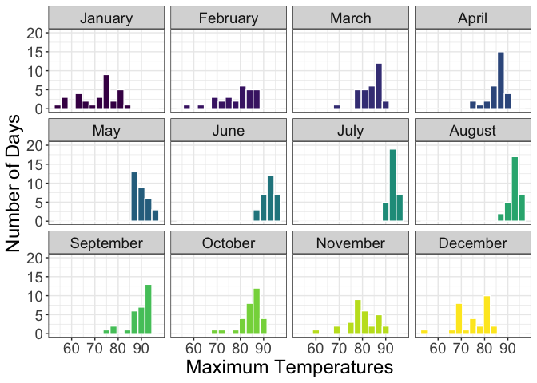
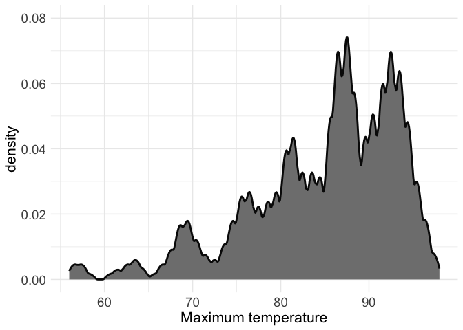
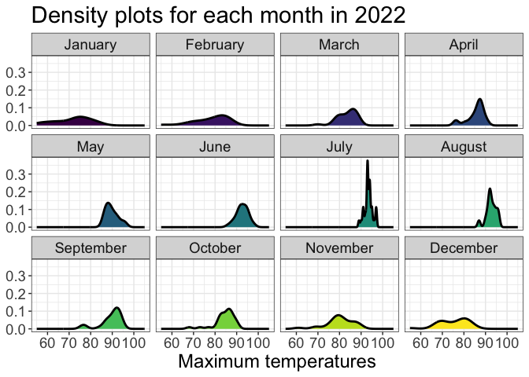
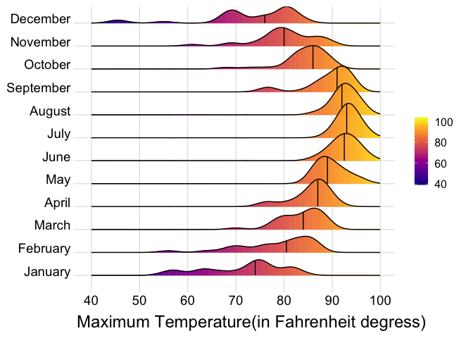
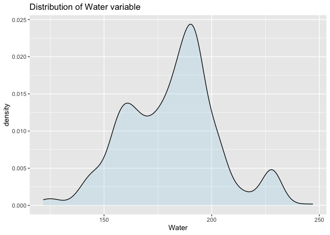
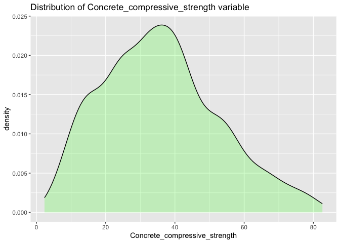
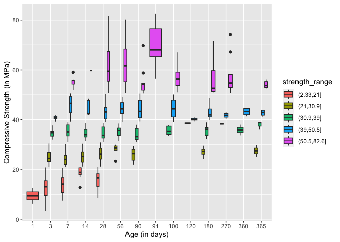
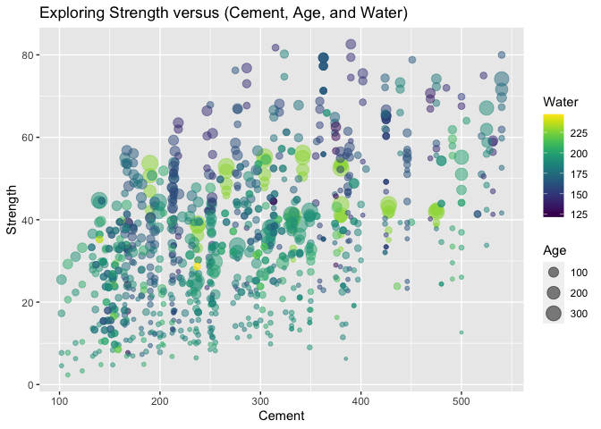

# Data Visualization Project 03

In this exercise you will explore methods to create different types of data visualizations (such as plotting text data, or exploring the distributions of continuous variables).

## PART 1: Density Plots

Using the dataset obtained from FSU's [Florida Climate Center](https://climatecenter.fsu.edu/climate-data-access-tools/downloadable-data), for a station at Tampa International Airport (TPA) for 2022, attempt to recreate the charts shown below which were generated using data from 2016. You can read the 2022 dataset using the code below:


```r
library(tidyverse)
```

```
## ── Attaching core tidyverse packages ──────────────────────── tidyverse 2.0.0 ──
## ✔ dplyr     1.1.4     ✔ readr     2.1.5
## ✔ forcats   1.0.0     ✔ stringr   1.5.1
## ✔ ggplot2   3.4.4     ✔ tibble    3.2.1
## ✔ lubridate 1.9.3     ✔ tidyr     1.3.0
## ✔ purrr     1.0.2     
## ── Conflicts ────────────────────────────────────────── tidyverse_conflicts() ──
## ✖ dplyr::filter() masks stats::filter()
## ✖ dplyr::lag()    masks stats::lag()
## ℹ Use the conflicted package (<http://conflicted.r-lib.org/>) to force all conflicts to become errors
```

```r
library(viridis)
```

```
## Loading required package: viridisLite
```

```r
library(tidyverse)
library(ggridges)
```


```r
weather_tpa <- read_csv("https://raw.githubusercontent.com/reisanar/datasets/master/tpa_weather_2022.csv")
# random sample 
sample_n(weather_tpa, 4)
```

```
## # A tibble: 4 × 7
##    year month   day precipitation max_temp min_temp ave_temp
##   <dbl> <dbl> <dbl>         <dbl>    <dbl>    <dbl>    <dbl>
## 1  2022    12     9             0       79       63     71  
## 2  2022    11     4             0       86       67     76.5
## 3  2022     3    21             0       85       57     71  
## 4  2022     3     1             0       79       60     69.5
```

See <https://www.reisanar.com/slides/relationships-models#10> for a reminder on how to use this type of dataset with the `lubridate` package for dates and times (example included in the slides uses data from 2016).


```r
weather_tpa
```

```
## # A tibble: 365 × 7
##     year month   day precipitation max_temp min_temp ave_temp
##    <dbl> <dbl> <dbl>         <dbl>    <dbl>    <dbl>    <dbl>
##  1  2022     1     1       0             82       67     74.5
##  2  2022     1     2       0             82       71     76.5
##  3  2022     1     3       0.02          75       55     65  
##  4  2022     1     4       0             76       50     63  
##  5  2022     1     5       0             75       59     67  
##  6  2022     1     6       0.00001       74       56     65  
##  7  2022     1     7       0.00001       81       63     72  
##  8  2022     1     8       0             81       58     69.5
##  9  2022     1     9       0             84       65     74.5
## 10  2022     1    10       0             81       64     72.5
## # ℹ 355 more rows
```

Using the 2022 data:

(a) Create a plot like the one below:


```r
str(weather_tpa)
```

```
## spc_tbl_ [365 × 7] (S3: spec_tbl_df/tbl_df/tbl/data.frame)
##  $ year         : num [1:365] 2022 2022 2022 2022 2022 ...
##  $ month        : num [1:365] 1 1 1 1 1 1 1 1 1 1 ...
##  $ day          : num [1:365] 1 2 3 4 5 6 7 8 9 10 ...
##  $ precipitation: num [1:365] 0e+00 0e+00 2e-02 0e+00 0e+00 1e-05 1e-05 0e+00 0e+00 0e+00 ...
##  $ max_temp     : num [1:365] 82 82 75 76 75 74 81 81 84 81 ...
##  $ min_temp     : num [1:365] 67 71 55 50 59 56 63 58 65 64 ...
##  $ ave_temp     : num [1:365] 74.5 76.5 65 63 67 65 72 69.5 74.5 72.5 ...
##  - attr(*, "spec")=
##   .. cols(
##   ..   year = col_double(),
##   ..   month = col_double(),
##   ..   day = col_double(),
##   ..   precipitation = col_double(),
##   ..   max_temp = col_double(),
##   ..   min_temp = col_double(),
##   ..   ave_temp = col_double()
##   .. )
##  - attr(*, "problems")=<externalptr>
```


```r
weather_tpa_clean <- weather_tpa %>%
 mutate(doy = ymd(paste(year, month, day, sep = "-")))
weather_tpa_clean
```

```
## # A tibble: 365 × 8
##     year month   day precipitation max_temp min_temp ave_temp doy       
##    <dbl> <dbl> <dbl>         <dbl>    <dbl>    <dbl>    <dbl> <date>    
##  1  2022     1     1       0             82       67     74.5 2022-01-01
##  2  2022     1     2       0             82       71     76.5 2022-01-02
##  3  2022     1     3       0.02          75       55     65   2022-01-03
##  4  2022     1     4       0             76       50     63   2022-01-04
##  5  2022     1     5       0             75       59     67   2022-01-05
##  6  2022     1     6       0.00001       74       56     65   2022-01-06
##  7  2022     1     7       0.00001       81       63     72   2022-01-07
##  8  2022     1     8       0             81       58     69.5 2022-01-08
##  9  2022     1     9       0             84       65     74.5 2022-01-09
## 10  2022     1    10       0             81       64     72.5 2022-01-10
## # ℹ 355 more rows
```

```r
#Custom labeller function for month labels
label_month <- function(variable, value) {
 month.name[as.integer(value)]
}

ggplot(data = weather_tpa_clean) +
  geom_histogram(aes(x = max_temp, fill = as.factor(month)), binwidth = 3, color = "white", width = 0.1) +
  theme_bw() +
  scale_fill_viridis_d() +
  facet_wrap(~ month, labeller = label_month) +
  scale_y_continuous(limits = c(0, 20), breaks = seq(0, 20, by = 5)) + # Set y-axis limits and breaks
  scale_x_continuous(limits = c(50, 100), expand = c(0,0), breaks = seq(60, 90, by = 10)) + # Set x-axis breaks
  theme(legend.position = "none",
  strip.text = element_text(size = 14),
  axis.text.x = element_text(size = 14), 
  axis.text.y = element_text(size = 14), 
  axis.title.x = element_text(size = 18),
  axis.title.y = element_text(size = 18)) +
  labs(x = "Maximum Temperatures", y = "Number of Days")
```

```
## Warning: The `labeller` API has been updated. Labellers taking `variable` and `value`
## arguments are now deprecated.
## ℹ See labellers documentation.
```

```
## Warning: Removed 2 rows containing non-finite values (`stat_bin()`).
```

```
## Warning: Removed 24 rows containing missing values (`geom_bar()`).
```

<!-- -->

Hint: the option `binwidth = 3` was used with the `geom_histogram()` function.

(b) Create a plot like the one below:


Hint: check the `kernel` parameter of the `geom_density()` function, and use `bw = 0.5`.


```r
# Create the density plot
ggplot(weather_tpa_clean, aes(x = max_temp)) +
  geom_density(bw = 0.5, 
               kernel = "epanechnikov",
               color = "gray3", 
               fill = "grey50", 
               size = 1) +
  scale_x_continuous(limits = c(56, 98), breaks = seq(60, 90, by = 10)) + # Set x-axis
  scale_y_continuous(limits = c(0.00, 0.08), breaks = seq(0.00, 0.09, by = 0.02)) +
  labs(x = "Maximum temperature", y = "density") +
  theme_minimal() +
  theme(legend.position = "none",
  axis.text.x = element_text(size = 14), 
  axis.text.y = element_text(size = 14), 
  axis.title.x = element_text(size = 16),
  axis.title.y = element_text(size = 16))
```

```
## Warning: Using `size` aesthetic for lines was deprecated in ggplot2 3.4.0.
## ℹ Please use `linewidth` instead.
## This warning is displayed once every 8 hours.
## Call `lifecycle::last_lifecycle_warnings()` to see where this warning was
## generated.
```

```
## Warning: Removed 4 rows containing non-finite values (`stat_density()`).
```

<!-- -->

(c) Create a plot like the one below:


Hint: default options for `geom_density()` were used.


```r
weather_tpa_clean %>%
  ggplot(mapping = aes(x = max_temp, fill = month)) +
  geom_density(color = "black", size=1) +
  facet_wrap(~ month, labeller = label_month) +
  theme_bw() +
  scale_x_continuous(limits = c(55, 105), breaks = seq(60, 100, by = 10)) +
  labs(x = "Maximum temperatures", title = "Density plots for each month in 2022") +
  scale_fill_viridis() +
  theme(legend.position = "none",
  strip.text = element_text(size = 14),
  axis.text.x = element_text(size = 14), 
  axis.text.y = element_text(size = 14), 
  axis.title.x = element_text(size = 18),
  axis.title.y = element_blank(),
  plot.title = element_text(size = 22))
```

```
## Warning: The `labeller` API has been updated. Labellers taking `variable` and `value`
## arguments are now deprecated.
## ℹ See labellers documentation.
```

```
## Warning: Removed 2 rows containing non-finite values (`stat_density()`).
```

<!-- -->

(d) Generate a plot like the chart below:


Hint: use the`{ggridges}` package, and the `geom_density_ridges()` function paying close attention to the `quantile_lines` and `quantiles` parameters. The plot above uses the `plasma` option (color scale) for the *viridis* palette.


```r
library(forcats)

# Create a custom factor with ordered months
# weather_tpa_clean$month <- factor(weather_tpa_clean$month, levels = 1:12, labels = month.name)

ggplot(weather_tpa_clean, aes(x = max_temp, y = fct_reorder(month.name[month], month), fill = stat(x))) +
  geom_density_ridges_gradient(scale = 1.5, quantile_lines = TRUE, quantiles = 2, color = "black", size = 1) +
  scale_fill_viridis(option = "plasma") +
  scale_x_continuous(limits = c(40, 100), breaks = seq(40, 100, by = 10)) +
  labs(x = "Maximum Temperature(in Fahrenheit degress)", y = NULL) +
  theme_ridges() +
  theme(legend.title=element_blank(),
        axis.text.x = element_text(size = 14), 
        axis.text.y = element_text(size = 14), 
        axis.title.y = element_blank(),
        axis.title.x = element_text(hjust = 0, size = 18)) 
```

```
## Warning in geom_density_ridges_gradient(scale = 1.5, quantile_lines = TRUE, :
## Ignoring unknown parameters: `size`
```

```
## Warning: `stat(x)` was deprecated in ggplot2 3.4.0.
## ℹ Please use `after_stat(x)` instead.
## This warning is displayed once every 8 hours.
## Call `lifecycle::last_lifecycle_warnings()` to see where this warning was
## generated.
```

```
## Picking joint bandwidth of 1.93
```

<!-- -->

(e) Create a plot of your choice that uses the attribute for precipitation *(values of -99.9 for temperature or -99.99 for precipitation represent missing data)*.


```r
weather_tpa_clean
```

```
## # A tibble: 365 × 8
##     year month   day precipitation max_temp min_temp ave_temp doy       
##    <dbl> <dbl> <dbl>         <dbl>    <dbl>    <dbl>    <dbl> <date>    
##  1  2022     1     1       0             82       67     74.5 2022-01-01
##  2  2022     1     2       0             82       71     76.5 2022-01-02
##  3  2022     1     3       0.02          75       55     65   2022-01-03
##  4  2022     1     4       0             76       50     63   2022-01-04
##  5  2022     1     5       0             75       59     67   2022-01-05
##  6  2022     1     6       0.00001       74       56     65   2022-01-06
##  7  2022     1     7       0.00001       81       63     72   2022-01-07
##  8  2022     1     8       0             81       58     69.5 2022-01-08
##  9  2022     1     9       0             84       65     74.5 2022-01-09
## 10  2022     1    10       0             81       64     72.5 2022-01-10
## # ℹ 355 more rows
```


```r
#`doy` is numeric and represents day of the year, convert it to a date format
monthly_precipitation <-weather_tpa_clean  %>%
  filter(precipitation != -99.99)%>%
  mutate(date = as.Date(doy, origin = "2022-01-01")) %>%  # Convert doy to actual date
  mutate(month = floor_date(date, "month"))  # Extract month for aggregation

# Aggregate precipitation by month
monthly_precipitation1 <- monthly_precipitation %>%
  group_by(month) %>%
  summarise(total_precipitation = sum(precipitation, na.rm = TRUE))

# Plot
ggplot(monthly_precipitation1, aes(x = month, y = total_precipitation)) +
  geom_bar(stat = "identity", fill = "royalblue4") +
  labs(x = "Month", y = "Total Precipitation (inches)", title = "Distribution of Monthly Total Precipitation in 2022") +
  scale_x_date(date_labels = "%b", date_breaks = "1 month") +  # Format x-axis labels as month names
  theme_minimal() +
  theme(
    axis.title.x = element_text(size = 14),
    axis.title.y = element_text(size = 14),
    axis.text.x = element_text(size = 12, angle = 45, hjust = 1),
    axis.text.y = element_text(size = 12),
    plot.title = element_text(size = 16, face = "bold", hjust = 0.5)
  )
```

<!-- -->

 Comments:  The above chart shows the monthly precipitation distribution for 2022, measured in inches. January and March have low precipitation, around 2.5 to 3 inches, with February being the lowest at 1 inch. April exceeds 7 inches, while June and July see substantial rainfall of 9 and 11 inches respectively. September peaks at over 12 inches, the highest for the year, followed by a sharp decline in October to just above 1 inch. November increases moderately to 4 inches, and December ends the year with around 2 inches. Overall, precipitation varies greatly, with notable peaks in April, June, July, and September.

## PART 2

> **You can choose to work on either Option (A) or Option (B)**. Remove from this template the option you decided not to work on.

### Option (B): Data on Concrete Strength

Concrete is the most important material in **civil engineering**. The concrete compressive strength is a highly nonlinear function of *age* and *ingredients*. The dataset used here is from the [UCI Machine Learning Repository](https://archive.ics.uci.edu/ml/index.php), and it contains 1030 observations with 9 different attributes 9 (8 quantitative input variables, and 1 quantitative output variable). A data dictionary is included below:

| Variable                      | Notes                 |
|-------------------------------|-----------------------|
| Cement                        | kg in a $m^3$ mixture |
| Blast Furnace Slag            | kg in a $m^3$ mixture |
| Fly Ash                       | kg in a $m^3$ mixture |
| Water                         | kg in a $m^3$ mixture |
| Superplasticizer              | kg in a $m^3$ mixture |
| Coarse Aggregate              | kg in a $m^3$ mixture |
| Fine Aggregate                | kg in a $m^3$ mixture |
| Age                           | in days               |
| Concrete compressive strength | MPa, megapascals      |

Below we read the `.csv` file using `readr::read_csv()` (the `readr` package is part of the `tidyverse`)


```r
concrete <- read_csv("/Users/prathyushabhuma/Documents/Florida Polytechnic University/Data Visualization and Reproducible Research/dataviz_final_project/data/concrete.csv", col_types = cols())
```


```r
dim(concrete)
```

```
## [1] 1030    9
```


```r
summary(concrete)
```

```
##      Cement      Blast_Furnace_Slag    Fly_Ash           Water      
##  Min.   :102.0   Min.   :  0.0      Min.   :  0.00   Min.   :121.8  
##  1st Qu.:192.4   1st Qu.:  0.0      1st Qu.:  0.00   1st Qu.:164.9  
##  Median :272.9   Median : 22.0      Median :  0.00   Median :185.0  
##  Mean   :281.2   Mean   : 73.9      Mean   : 54.19   Mean   :181.6  
##  3rd Qu.:350.0   3rd Qu.:142.9      3rd Qu.:118.27   3rd Qu.:192.0  
##  Max.   :540.0   Max.   :359.4      Max.   :200.10   Max.   :247.0  
##  Superplasticizer Coarse_Aggregate Fine_Aggregate       Age        
##  Min.   : 0.000   Min.   : 801.0   Min.   :594.0   Min.   :  1.00  
##  1st Qu.: 0.000   1st Qu.: 932.0   1st Qu.:731.0   1st Qu.:  7.00  
##  Median : 6.350   Median : 968.0   Median :779.5   Median : 28.00  
##  Mean   : 6.203   Mean   : 972.9   Mean   :773.6   Mean   : 45.66  
##  3rd Qu.:10.160   3rd Qu.:1029.4   3rd Qu.:824.0   3rd Qu.: 56.00  
##  Max.   :32.200   Max.   :1145.0   Max.   :992.6   Max.   :365.00  
##  Concrete_compressive_strength
##  Min.   : 2.332               
##  1st Qu.:23.707               
##  Median :34.443               
##  Mean   :35.818               
##  3rd Qu.:46.136               
##  Max.   :82.599
```

Let us create a new attribute for visualization purposes, `strength_range`:


```r
new_concrete <- concrete %>%
  mutate(strength_range = cut(Concrete_compressive_strength, 
                              breaks = quantile(Concrete_compressive_strength, 
                                                probs = seq(0, 1, 0.2))) )
```


```r
head(new_concrete)
```

```
## # A tibble: 6 × 10
##   Cement Blast_Furnace_Slag Fly_Ash Water Superplasticizer Coarse_Aggregate
##    <dbl>              <dbl>   <dbl> <dbl>            <dbl>            <dbl>
## 1   540                  0        0   162              2.5            1040 
## 2   540                  0        0   162              2.5            1055 
## 3   332.               142.       0   228              0               932 
## 4   332.               142.       0   228              0               932 
## 5   199.               132.       0   192              0               978.
## 6   266                114        0   228              0               932 
## # ℹ 4 more variables: Fine_Aggregate <dbl>, Age <dbl>,
## #   Concrete_compressive_strength <dbl>, strength_range <fct>
```

1.  Explore the distribution of 2 of the continuous variables available in the dataset. Do ranges make sense? Comment on your findings.


```r
print('Summary Statistics for variable Water:')
```

```
## [1] "Summary Statistics for variable Water:"
```

```r
summary(new_concrete$Water)
```

```
##    Min. 1st Qu.  Median    Mean 3rd Qu.    Max. 
##   121.8   164.9   185.0   181.6   192.0   247.0
```

```r
ggplot(new_concrete, aes(x=Water)) +
    geom_density(alpha=.2, fill="#87CEEB")+
  ggtitle('Distribution of Water variable')
```

<!-- -->

 Comments: Water in kgs can't be negative. Distribution for this continuous variable water makes sense with the range between 121.8 and 247.0 kg, and a mean of 181.6 kg.


```r
print('Summary Statistics for variable Concrete_compressive_strength:')
```

```
## [1] "Summary Statistics for variable Concrete_compressive_strength:"
```

```r
summary(new_concrete$Concrete_compressive_strength)
```

```
##    Min. 1st Qu.  Median    Mean 3rd Qu.    Max. 
##   2.332  23.707  34.443  35.818  46.136  82.599
```

```r
ggplot(new_concrete, aes(x=Concrete_compressive_strength)) +
    geom_density(alpha=.2, fill="#00FF00")+
  ggtitle('Distribution of Concrete_compressive_strength variable')
```

<!-- -->

 Comments: Concrete_compressive_strength in MPa can't be negative. Distribution for this continuous variable makes sense with the range between 2.332 and 82.599 MPa , and a mean of 35.818 MPa.

2.  Use a *temporal* indicator such as the one available in the variable `Age` (measured in days). Generate a plot similar to the one shown below. Comment on your results.


```r
ggplot(data=new_concrete %>% filter(!is.na(strength_range)), aes(x=as.factor(Age), y=Concrete_compressive_strength, fill=strength_range))+
  geom_boxplot()+
  labs(x = "Age (in days)", y = "Compressive Strength (in MPa)")
```

<!-- -->

 Comments: We observed horizontal patterns for each color, indicating multiple segments within the data. This suggests that specific combinations of materials result in particular compressive strengths, and altering these mixture combinations can change the compressive strength.

3.  Create a scatterplot similar to the one shown below. Pay special attention to which variables are being mapped to specific aesthetics of the plot. Comment on your results.


```r
ggplot(data=new_concrete, aes(x=Cement, y=Concrete_compressive_strength))+
  geom_point(aes(size=Age,color=Water), alpha = 0.5)+
  scale_color_viridis(discrete = FALSE, option = "D")+
  labs(x = "Cement", y = "Strength")+
  ggtitle('Exploring Strength versus (Cement, Age, and Water)')
```

<!-- -->

 Comments: This indicates that at higher levels, as cement content increases, so does strength. Most of the purple dots are at the top, indicating that optimal water content results in higher compressive strength. Smaller dots tend to be at the bottom, suggesting that lower age correlates with lower strength. However, these trends are not entirely consistent.
